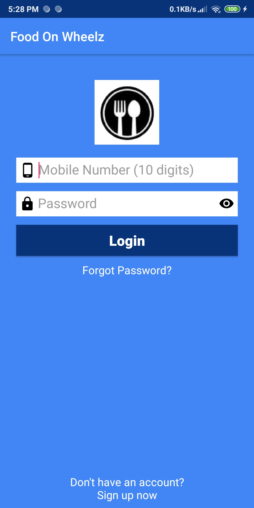

# food-on-wheelz

- Technical Features:
  - Kotlin
  - Login, Signup & Forgot password feature by External APIs(currently handled by INTERNSHALA APIs)
  - Fragment use(Minimum Activities)
  - Room Persistence Library for local favourite hotels
  - Proper REGEX & form validations during signup & login
  - Adapters for RecyclerViews
  - Hotel lists, food items of every hotel, order list is handled by APIs. Orders are saved on Cloud/Database of INTERNSHALA
  
## Hola People,
Another app made by me which is generally taken as one of the starting apps by developers - The Food Ordering App.
It cotains list of hotels from which you can order any food item(quantity fixed to 1 per item for now, I don't want you to get fat :p).
Just tap on any hotel, select items you wanna eat & place the order. Order history is also handled by API.

## Screenshots:
  
 
 
